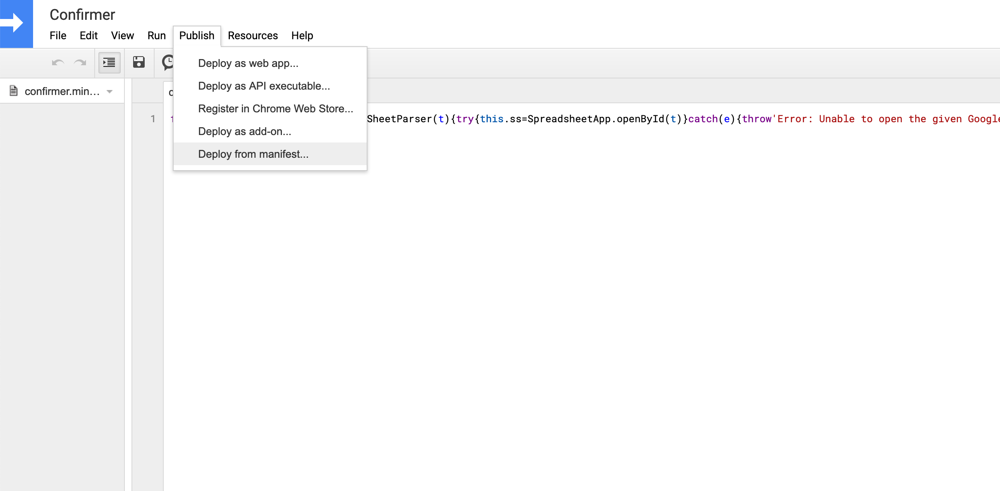
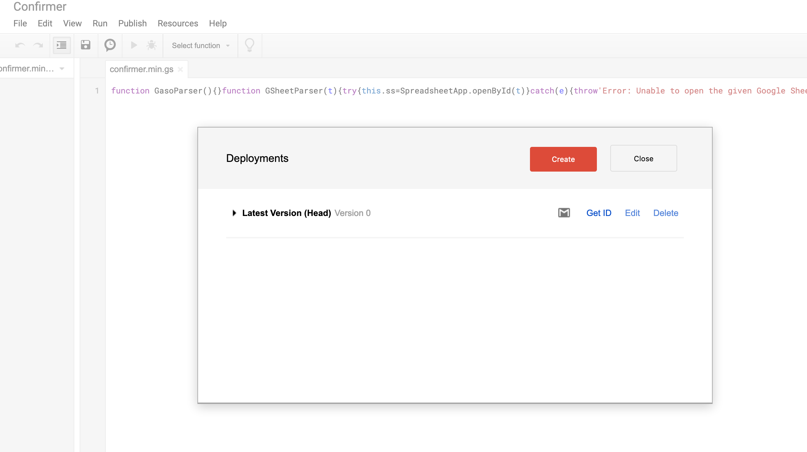

# Confirmer

A Gmail add-on that manages recurring confirmation emails. Pulls information
from Google Sheets (e.g. schedules, contact info, email content).

## Requirements
- git
- sh / bash / zsh
- [NPM](https://www.npmjs.com/get-npm): `npm install n -g`
- [UglifyJS2](https://github.com/mishoo/UglifyJS2): `npm install uglify-js -g`
- [Google Clasp](https://github.com/google/clasp): `npm i @google/clasp -g`

## For End-Users
### Installation
1. Open a command line shell (Linux / Mac OSX: Terminal. Windows: Powershell).
2. Install git if it is your first time using git. The tutorial can be found
   [here](https://git-scm.com/book/en/v2/Getting-Started-Installing-Git).
3. Install npm if it is your first time using npm. The tutorial can be found
   [here](https://www.npmjs.com/get-npm).
4. Install UglifyJS2 if it is your first time using UglifyJS2. The tutorial
   can be found [here](https://github.com/mishoo/UglifyJS2)
3. Install clasp if it is your first time using clasp. The tutorial can be 
   found [here](https://github.com/google/clasp).
3. Run the following commands:
```bash
foo@bar:~$ git init
foo@bar:~$ git clone https://github.com/KeiferC/Confirmer.git
foo@bar:~$ cd Confirmer
foo@bar:~$ ./build.sh
```
4. Allow permissions when prompted by Google.
5. Select `standalone` on your shell when prompted by clasp.
```bash
? Create which script? (Use arrow keys)
> standalone
  docs
  slides
  forms
  webapp
  api
```
6. Deploy your add-on with the following command:
```bash
foo@bar:~$ clasp deploy --versionNumber 1 --description "First deployment"
```
7. Log in to [Google Script](https://script.google.com/). Click on "My
   Projects" on the left sidebar. 


8. Click on "Confirmer", which should lead you to the following page.


9. Click on "Open Project" on the right sidebar, which should lead you to the
   following page.


10. Click on "Publish", then click on "Deploy from manifest...".



11. Click on the red "Create" button.



12. 

## For Developers
### Installation
```bash
foo@bar:~$ git init
foo@bar:~$ git clone https://github.com/KeiferC/Confirmer.git
foo@bar:~$ cd Confirmer
foo@bar:~$ ./build.sh
```

Future features? ----------
     - Expand to create multiple confirmer cards based on needs?
             - Delete confirmer // if multiple cards
     - Add feature that allows for consistent sends? e.g. weekly
     - Add feature that allows users to select number of days prior reminder
     - Send warning when number of participants < given
     - Implement suggested searches for column names - trie?
     - Auto-sort sheets for users? - Too much removal of autonomy?
     - Users manually set timezone
             - JS relies on client's timezone. Add-on sees Google as the
               client
             - userTimezone.id — the user's timezone identifier
                     - e.g. America/New_York.
